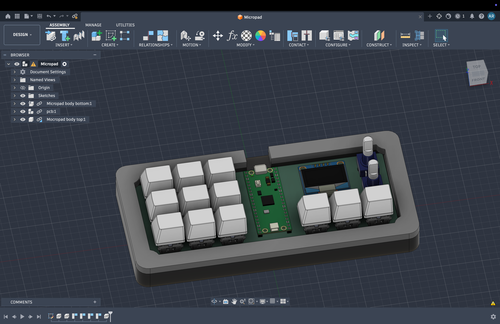
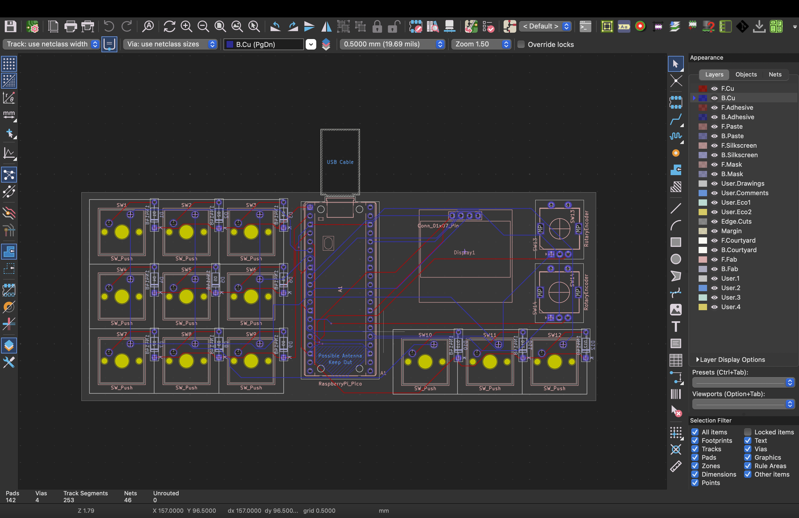
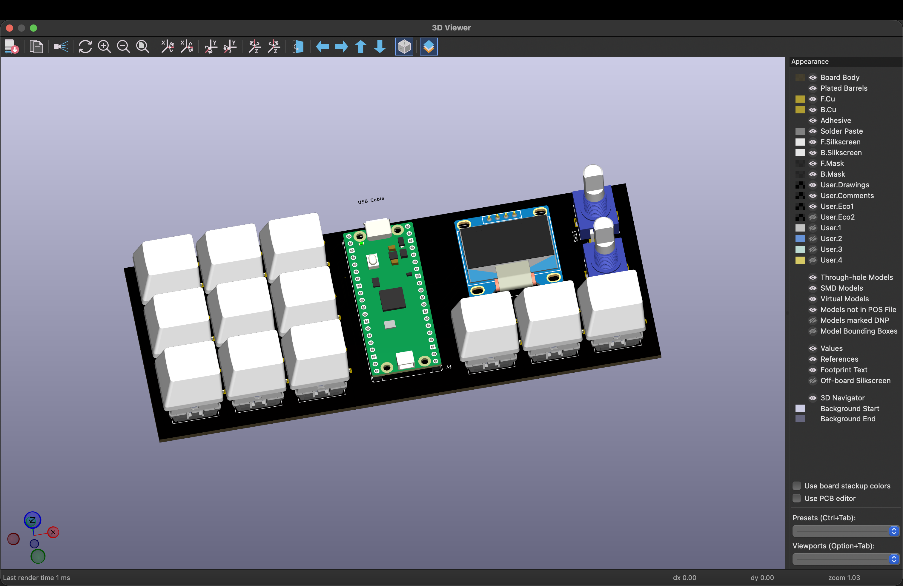
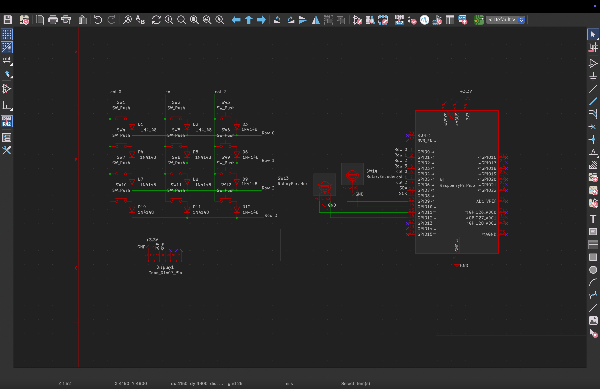

# Macropad

This is my macropad that i am gonna be using to increase my productivity,
[Design link](https://www.tldraw.com/f/6q5K0vjcdTGi3-sUILjF2?d=v49.-201.1104.759.page)

## Why i made this

This macropad have all the shortcuts that I commonly use in my coding and research these are located on left side of the macropad, on the right side I have music control and display I am gonna be using it on study sessions so i don't have to look on my screen to control music

## Project images

### Full assembly

### PCB

### Schematic

## BOM

check [BOM](./BOM.csv)

## Author

Created by [ApishRana](https://github.com/ApishRana)
